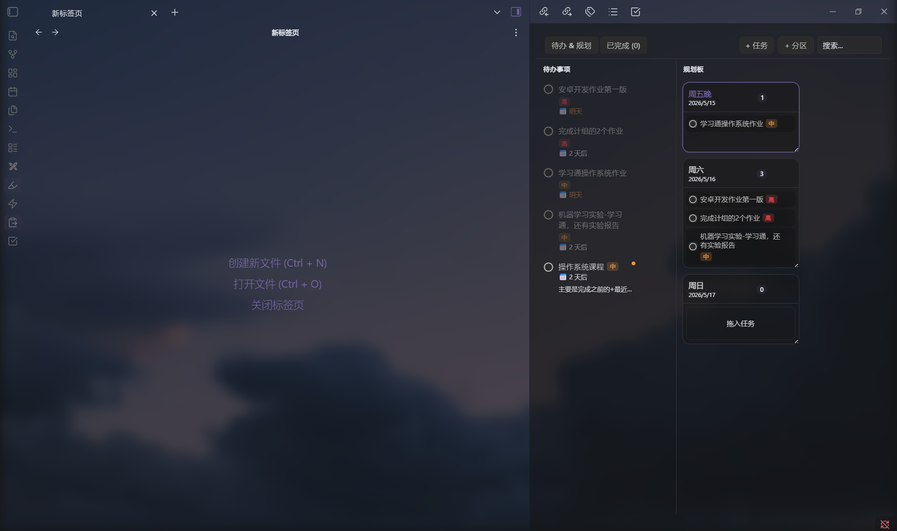
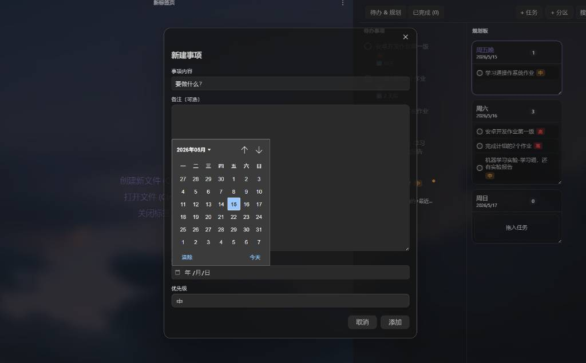
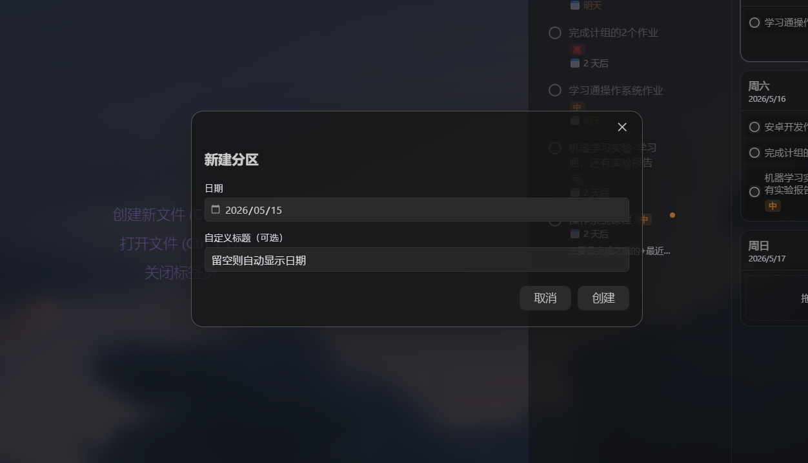

# Simple Todo List

**English** | [中文](#简单待办清单)

---

A clean and simple todo list plugin for [Obsidian](https://obsidian.md). No clutter, no steep learning curve — just write your tasks, plan your days, and drag everything into place.

## Why Simple Todo List?

- **Simple** — minimal interface, zero distractions. Add a task in seconds.
- **Easy to use** — everything is one click or one drag away. No complex setup.
- **Drag-and-drop first** — drag tasks into planning zones, drag zones to reorder. Your hands never leave the mouse.

## Features

- **Tasks** — title, notes, due date, priority (high / medium / low)
- **Planning board** — create date-labeled zones to organize tasks by day
- **Drag to plan** — drag tasks from the list into any zone; drag zone headers to reorder
- **Visual cues** — unplanned tasks show an orange dot; planned tasks are dimmed
- **Completed bin** — check off tasks, restore or permanently delete them
- **Real-time search** — instant filtering without losing focus
- **Resizable zones** — drag the corner of any zone card to resize it

## Usage

1. Click the ✅ icon in the ribbon to open the panel
2. Click **+ Task** to add a new task

   

3. Click **+ Zone** to create a planning zone

   

4. **Drag** tasks from the left list into a zone on the right
5. **Drag** a zone's header to reorder zones
6. **Drag** a task from a zone back to the left panel to unassign it
7. Click the circle to complete a task — it moves to the **Completed** tab

## Installation

### From Obsidian Community Plugins (recommended)
1. Open Obsidian Settings → Community plugins → Browse
2. Search for **Simple Todo List**
3. Click Install, then Enable

### Manual
1. Download `main.js`, `styles.css`, `manifest.json` from the [latest release](../../releases/latest)
2. Create folder `<your vault>/.obsidian/plugins/simple-todo-list/`
3. Copy the three files into that folder
4. Enable the plugin in Settings → Community plugins

## Author

**SeleneSu** — [GitHub](https://github.com/SeleneSu)

## License

MIT

---

# 简单待办清单

[English](#simple-todo-list) | **中文**

---

一个简洁易用的 [Obsidian](https://obsidian.md) 待办清单插件。界面干净，没有多余功能，写任务、规划日程、拖拽整理，一气呵成。

## 为什么选择 Simple Todo List？

- **简洁** — 界面极简，没有干扰。几秒钟就能添加一条任务。
- **操作简单** — 所有操作一键或一拖即可完成，无需任何学习成本。
- **拖拽优先** — 拖任务进分区，拖分区调顺序，全程鼠标不离手。

## 功能特性

- **任务管理** — 支持标题、备注、截止日期、优先级（高 / 中 / 低）
- **规划板** — 创建带日期标签的分区，按天规划任务
- **拖拽整理** — 拖任务进分区；拖分区标题栏重新排序
- **视觉提示** — 未规划任务显示橙色小圆点；已规划任务自动变暗
- **已完成箱** — 勾选完成，可恢复或永久删除
- **实时搜索** — 即时过滤，不打断操作焦点
- **分区大小可调** — 拖动分区卡片右下角自由调整大小

## 使用方法

1. 点击左侧边栏 ✅ 图标打开面板
2. 点击 **+ 任务** 新建待办事项

   

3. 点击 **+ 分区** 创建规划分区

   

4. **拖动**左侧任务到右侧分区中
5. **拖动**分区标题栏调整分区顺序
6. **拖动**分区内的任务回左侧列表可取消分配
7. 点击圆形复选框完成任务，移入**已完成** Tab

## 安装方式

### 通过 Obsidian 社区插件（推荐）
1. 打开 Obsidian 设置 → 第三方插件 → 浏览
2. 搜索 **Simple Todo List**
3. 点击安装，然后启用

### 手动安装
1. 从 [最新 Release](../../releases/latest) 下载 `main.js`、`styles.css`、`manifest.json`
2. 在 Vault 中创建文件夹 `<你的Vault>/.obsidian/plugins/simple-todo-list/`
3. 将三个文件复制到该文件夹
4. 在设置 → 第三方插件中启用插件

## 作者

**SeleneSu** — [GitHub](https://github.com/SeleneSu)

## 许可证

MIT
